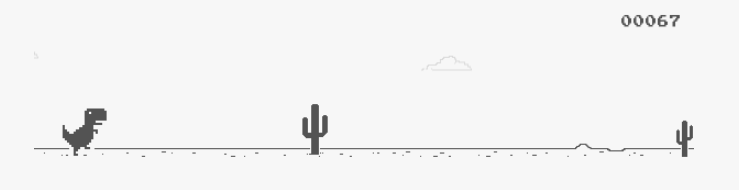

# Project 4: Longan Nano Minigame

For more details please refer to the [course page](https://robotics.shanghaitech.edu.cn/courses/ca/22s/projects/4/).

In this project, we implemented a Chrome Dino Runner Game using the Longan Nano development board.

We utilized PlarformIO to interact with the development board and support cross-language programming. For example, we implemented most of the framework by C, but some of the auxiliary functions are implemented by RISC-V instruction set. The functions can be invoked bidirectionally.

The game we implemented includes:

- A simple start menu.
- A helping panel demonstrating how to control the T-Rex.
- A mode-selection panel to choose easy mode or hard mode.
- A live score board. The score increases as the T-Rex running.
- Two buttons to control the T-Rex to perform two different actions (jump and lower its head) to cross obstacles.
- Dynamically moved obstacles, including cactus on the ground and pterosaur flying in the sky.
- A invincible mode when the score reaches integer multiples of 100. The T-Rex will not be killed by obstacles under this mode. After the score increases by 50, the mode will temporarily disappear.

Here is the demo video:

<iframe height=498 width=510 src=Demo.m4v>
</iframe>
